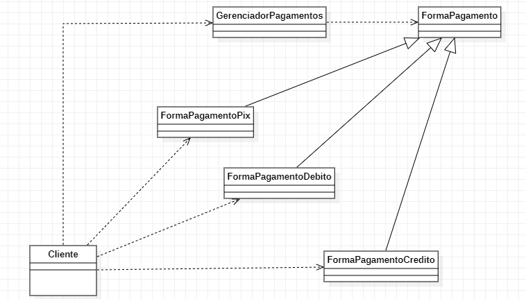

## 3. Padrões comportamentais:

---

### 3.7 Strategy

### 3.7.1 Introdução

Trata-se de um padrão de design comportamental que permite definir uma família de algoritmos, colocar cada um deles em uma classe separada e tornar seus objetos intercambiáveis.

### 3.7.2 Exemplo abordado
Para tal padrão de projeto, implementei um exemplo relacionado a forma de pagamento que será realizada. Ou seja se será cartão de credito 
débito, pix, pay pal, etc.

### 3.7.3 Diagrama de Classe do Exemplo

